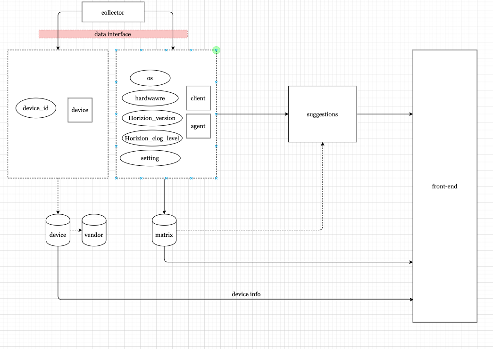
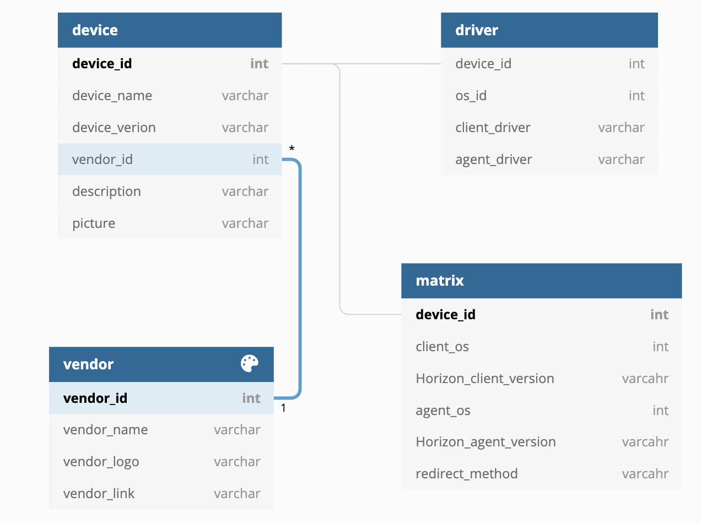

# DoctorJoe Intelligence

## front-end
Solution ： Vue.js + IView UI + Webpack

### Start
``` bash
# install dependencies
npm install

# serve with hot reload at localhost:8080
npm run dev

# build for production with minification
npm run build

# build for production and view the bundle analyzer report
npm run build --report

# run unit tests
npm run unit

# run e2e tests
npm run e2e

# run all tests
npm test
```

###  api design
later..

## back-end

### temporary design




Solution(temp): Flask + sql(mysql?)
### database design

1. Device Matrix
   
2. Device Info
3. Vendor Info

   