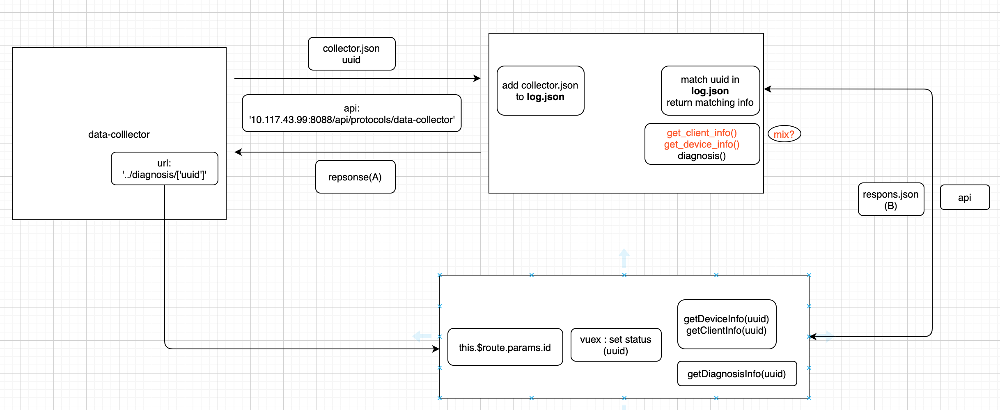

# DoctorJoe Intelligence

## front-end
Solution ： Vue.js + IView UI + Webpack

### Start
``` bash
# install dependencies
npm install

# serve with hot reload at localhost:8080
npm run dev

# build for production with minification
npm run build

# build for production and view the bundle analyzer report
npm run build --report

# run unit tests
npm run unit

# run e2e tests
npm run e2e

# run all tests
npm test
```


## back-end

### temporary design


Solution(temp): Flask + mysql + SQLAchemy

### Diagnosis function
...later
```py
def process_device(device_info):
    get_device_from_json()
    if device not in db.device:
        add device into db
    return device_name

def process_matrix(client_info, agent_info)
    get_matrix_from_json()
    if (client,agent,..) in  db.matrix:
        add_suggestions("...")

def diagnosis():
    ...
    return suggestions
```


### Data interface

#### New design


#### expected collector.json:
```json
{
    code:20022,  //identify collector
    data:{
        uuid:"123e4567-e89b-12d3-a456-426655440000", //identify user
        client: {
            "OSname":  "Windows 10",
            "OSver":  "1909",
            "clientver":  "8.0.0.11085",
            "usbdisk":  {
                "VID":  "090C",
                "PID":  "1000",
                "manufacturer":  "Compatible USB storage device",
                "name":  "USB Mass Storage Device",
                "driverprovider":  "Microsoft",
                "driverver":  "10.0.18362.1",
                "isRebootNeeded":  false,
                "isPresent":  true,
                "hasProblem":  false
            },
        },
        agent:{
            ...
        }   
    }
}
```
#### expected response(A):
```json
//success
{
    code:20022, // identify web server
    status:"success",
    url："http://10.117.43.99:8088/diagnosis/123e4567-e89b-12d3-a456-426655440000"

}
//failure
{
    code:20022, // identify web server
    status:"failure",
}

```


-----

#### Code demo
collector(C++):
1. use curl.h
```c
#include <curl/curl.h>
#include <json/json.h>
...
 curl = curl_easy_init();
  /* initalize custom header list (stating that Expect: 100-continue is not
     wanted */ 
  headerlist = curl_slist_append(headerlist, buf);
  if(curl) {
    /* what URL that receives this POST */ 
    curl_easy_setopt(curl, CURLOPT_URL, "http://10.117.43.99/api/protocol/upload_device_info");
    if ( (argc == 2) && (!strcmp(argv[1], "noexpectheader")) )
      /* only disable 100-continue header if explicitly requested */ 
      curl_easy_setopt(curl, CURLOPT_HTTPHEADER, headerlist);
    curl_easy_setopt(curl, CURLOPT_HTTPPOST, formpost);

```
+ https://curl.haxx.se/libcurl/c/libcurl-tutorial.html
+ https://blog.csdn.net/qq_32619837/article/details/89155787?depth_1-utm_source=distribute.pc_relevant.none-task&utm_source=distribute.pc_relevant.none-task

2. socket programming
```c
//post
#include<stdio.h>
#include<winsock2.h>
#include<windows.h>
#pragma comment(lib, "ws2_32.lib")
 
int main()
{
	int num;
 
	SOCKET s;
	WSADATA wsa;
	struct sockaddr_in serv;
 
	char sndBuf[1024], rcvBuf[2048];
 
	WSAStartup(MAKEWORD(2, 1), &wsa);
 
 
	if ((s = socket(AF_INET, SOCK_STREAM, 0))<0)
	{
		perror("socket error!");
		exit(1);
	}
 
	memset(&serv,0,sizeof(serv));
	serv.sin_family = AF_INET;
	serv.sin_port = htons(80);
	serv.sin_addr.S_un.S_addr = inet_addr("115.239.210.26");
 
	if ((connect(s, (struct sockaddr *)&serv, sizeof(serv)))<0)
	{
		perror("connet error!");
		exit(1);
	}
 
	memset(sndBuf, 0, 1024);
	memset(rcvBuf, 0, 2048);
 
	//头信息
    strcat(sndBuf, "POST ");
    strcat(sndBuf, "http://www.baidu.com");
    strcat(sndBuf, " HTTP/1.0\r\n");
    strcat(sndBuf, "Host: ");
    strcat(sndBuf, "baidu.com");
    strcat(sndBuf, "\r\n");
    strcat(sndBuf, "Connection: keep-alive\r\n");
 
    strcat(sndBuf, "\r\n");
 
	puts(sndBuf);
  
	if ((num = send(s,sndBuf,1024, 0))<0)
   {
		perror("send error!");
		exit(1);
	}
	
	puts("send success!\n");
 
	do{
 
		if ((num = recv(s, rcvBuf, 2048, 0))<0)
		{
			perror("recv error!");
			system("pause");
			exit(1);
		}
		else if (num>0)
		{
			printf("%s", rcvBuf);
			memset(rcvBuf, 0, 2048);
		}
	} while (num>0);
	
	puts("\nread success!\n");
 
	closesocket(s);
	
	system("pause");
	WSACleanup();
	
	return 0;
 
}
```
+ https://www.cnblogs.com/diligenceday/p/6255788.html


web service：
demo: directly get json:
```python
import json
import requests
response = requests.get('http://127.0.0.1:5000/matrix')
res = response.text
res = json.loads(res)
```

demo: set a new api
```python 
@app.route('/protocols/data_collector, methods=['GET','POST'])
@cross_origin()
def protocols():
    ...
```


   